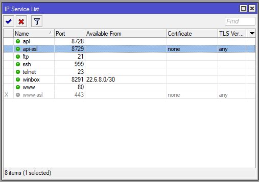
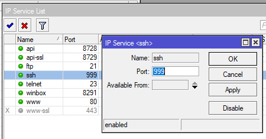
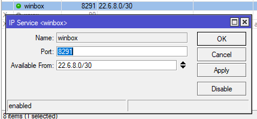
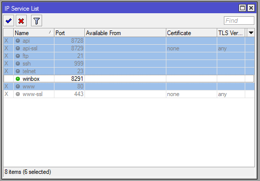

# LAB-10-Services
Kamis 14 Agustus 2025

# Service pada Mikrotik
  Service pada mikrotik memudahkan user dalam mengakses dan me-manage router. Secara default service ini akan dijalankan terus menerus oleh RB Mikrotik, kita bisa cek di **IP > Service**.  
    
    

  Berikut adalah informasi dan fungsi dari masing-masing service yang ada.  
  1. API  
     Application Programmable Interface adalah sebuah service yang mengizinkan user membuat custom software yang dapat berkomunikasi dengan router. Misak untuk mengambil informasi atau bahkan melakukan konfigurasi terhadap router. API berjalan di port 8728.  
  2. API-SSL  
     Service ini memiliki fungsi yang sama dengan API, namun kelebihannya dilengkapi dengan SSL Certificate sehingga lebih secure. API-SSL berjalan di port 8729.
  3. FTP  
     File Transfer Protocol adalah service yang memungkinkan user download dan upload data dari dan ke dalam router. Misalnya untuk mengunduh file backup. FTP berjalan pada port 21.  
  4. SSH  
     Secure Shell berfungsi untuk remote router mengunakan CLI, service ini hampir sama dengan Telnet, [erbedaannya adalah data yang ditransmisikan melalui jalur komunikasi SSH sudah dienskripsi sehingga lebih secure. SSH secara default berjalan di port 22.
  5. TELNET  
     Memiliki fungsi yang sama dengan SSH namun data yang di transmisikan tidak di enskripsi hingga kurang aman. Telnet berjalan di port 23.  
  6. WINBOX  
     Service yang mengizinkan koneksi ke router mengunakan aplikasi winbox yang berbasis GUI. Winbox berjalan di port 8291.  
  7. WWW  
     Mikrotik dapat diakses juga melalui Web Browser (WebFig) malalui port standart HTTP yaitu 80.  
  8. WWW-SSL  
     WWW-SSL adalah versi secure dari WWW dan sudah diengkapi dengan SSL sertificate. WWW-SSL berjalan di port 443.  
       Setelah mengetahui fungsi dari masing-masing service yang ada, dan sekarang apakah semua service di butuhkan? Ini sangat oenting sekali bagi seorang Administrator JAringan untuk mengetahui kapan service tertentu digunakan dan dimatikan.  

# Cara mengamankan Service di Mikrotik
**1. Mengubah Port Service pada Mikrotik**  
  Untuk mengubah port pada suatu service yang ada, caranya klik service yang akan diubah, kemudian ubah port number pada kolom port, kemudian Apply dan OK.  
    
    

**2. Menetapkan Available From (ACL)**  
  Service pada Mikrotik mendukung ACL (Access COntrol List), dengan ACL kita bisa menentukan sebuah service hanya dapat di akses oleh alamat IP tertentu saja. Fitur ini lebih aman dari pada mengubah port saja, nemun kekurangannya kita akan sulit untuk mengakses router jika sedang diluar jaringan. Jika pada kolom Available From yang kita isi adalah IP, maka hanya user dengan IP itu saja yang diperbolehkan, tapi kalau yang kita masukan adalah network IP, maka user yang termasuk dalam segmen IP tersebut dapat mengakses router.  
    
    

**3. Disable Service pada Mikrotik
  Dengan mematikan service tertentu, berarti kita mematikan service yang tidak dibutuhkan dan hanya menjalankan service yang diperlukan saja. Misalkan kita hanya mengakses Mikrotik via winbox saja, maka sebaiknya matikan saja service-service lain selain winbox.
  

# Kesimpulan
  Penting untuk network administrator untuk mengetahui service mana saja yang di butuhkan atau tidak. Karna jika running terus menerus celahnya bisa di manfaatkan oleh orang yang tidak bertanggung jawab untuk menyerang dan mengambil alih router dari port-port service yang terbuka.
